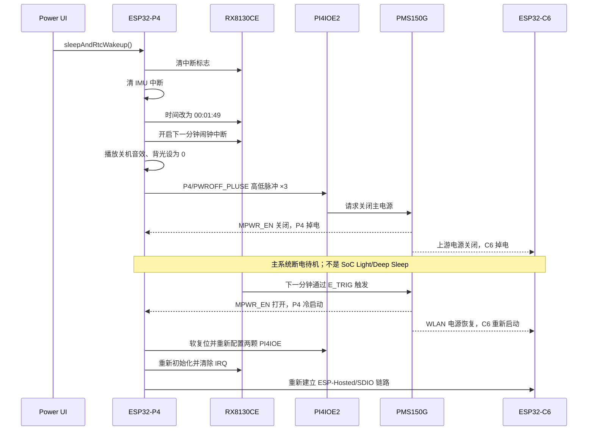

# Tab5 UserDemo“10s Sleep”低功耗与电源状态分析

> 分析范围：`platforms/tab5` 及其直接调用的 UserDemo 应用层代码  
> 分析方式：仅进行静态程序与硬件电源域分析，未修改源码，未对硬件进行电流实测  
> 文档日期：2026-08-07

## 1. 结论摘要

UserDemo 电源面板中的 **“Sleep，10 秒后自动唤醒”并没有让 ESP32-P4 或 ESP32-C6 进入 ESP-IDF 的 Light-sleep/Deep-sleep**。

它实际执行的是：

1. 配置板载 RX8130CE RTC 的中断；
2. 通过第二颗 PI4IOE 的 `P4/PWROFF_PLUSE` 向 PMS150G 电源管理 MCU 发送关机脉冲；
3. PMS150G 关闭 `MPWR_EN`，使主系统电源域掉电；
4. RX8130CE 到达下一分钟边界后，通过 `E_TRIG` 唤醒 PMS150G；
5. PMS150G 重新打开主电源；
6. ESP32-P4、ESP32-C6 和主系统外设重新上电，程序从复位入口完整冷启动。

因此，该功能更准确的描述是：

> **RTC 定时硬件关机/断电待机，随后重新上电冷启动。**

待机期间的低功耗来自关闭整机主电源域，而不是 P4/C6 内部的 SoC 睡眠模式。P4 的 RAM/任务状态和 PSRAM 内容不会作为睡眠上下文被恢复。

另外，代码显示的“10 秒”并不严格：程序把 RTC 设置为 `00:01:49`，再等待下一分钟事件，名义时间差是 **11 秒**；关机音效等待和电源时序还会改变用户实际观察到的间隔。

---

## 2. 功能调用链

### 2.1 UI 入口

文件：`app/apps/app_launcher/view/panel_power.cpp`

- 第 201 行显示：`It will automatically wake up in 10 seconds.`
- 第 206 行确认按钮调用：`GetHAL()->sleepAndRtcWakeup()`

### 2.2 RTC 关机唤醒逻辑

文件：`platforms/tab5/main/hal/components/hal_power.cpp`，第 137～162 行。

关键流程：

```cpp
clearRtcIrq();
clearImuIrq();

time.tm_hour = 0;
time.tm_min  = 1;
time.tm_sec  = 49;
rx8130.setTime(&time);

time.tm_hour = 0;
time.tm_min  = 2;
time.tm_sec  = 0;
rx8130.setAlarmIrq(&time);

powerOff();
```

`powerOff()`（同文件第 75～91 行）执行：

1. 播放关机音效；
2. 将显示背光设为 0；
3. 等待音频播放结束；
4. 调用 `bsp_generate_poweroff_signal()`。

### 2.3 PI4IOE 发送关机脉冲

文件：`platforms/tab5/components/m5stack_tab5/m5stack_tab5.c`，第 400～421 行。

`bsp_generate_poweroff_signal()` 对 PI4IOE2 的 P4 执行 3 次：

- 输出高电平 100 ms；
- 输出低电平 100 ms。

P4 对应硬件信号 `PWROFF_PLUSE`，该信号连接到 PMS150G 电源管理 MCU。PMS150G 随后控制 `MPWR_EN`，关闭主系统电源。

### 2.4 唤醒后的启动路径

RTC 中断通过硬件 `E_TRIG` 进入 PMS150G，PMS150G 重新打开 `MPWR_EN`。这不是从 `sleepAndRtcWakeup()` 后继续执行，而是重新上电复位：

```text
PMS150G 打开 MPWR_EN
  -> SYS_INT5V / SOC_3.3V 恢复
  -> ESP32-P4 从复位启动
  -> app_main()
  -> 注入 HalEsp32
  -> HalEsp32::init()
  -> 重新初始化 PI4IOE、RTC、Codec、IMU、显示、USB、RS-485 等
```

对应代码：

- `platforms/tab5/main/app_main.cpp` 第 160～179 行；
- `app/hal/hal.cpp` 中 `hal::Inject()` 调用 HAL 的 `init()`；
- `platforms/tab5/main/hal/hal_esp32.cpp` 第 47～127 行。

---

## 3. 为什么它不是 ESP32-P4 的 Light-sleep/Deep-sleep

10s Sleep 路径中没有调用以下 ESP-IDF 睡眠接口：

- `esp_light_sleep_start()`；
- `esp_deep_sleep_start()`；
- `esp_sleep_enable_timer_wakeup()`；
- 其他用于进入 P4 芯片睡眠并配置 SoC 唤醒源的 API。

虽然 `hal_power.cpp` 包含 `esp_sleep.h`、`esp_pm.h`，但这两个头文件本身不能证明进入了芯片低功耗模式；关键是实际执行路径没有调用睡眠 API。

代码最后调用的是外部电源管理链路：

```text
P4 软件
 -> PI4IOE2.P4 / PWROFF_PLUSE
 -> PMS150G
 -> MPWR_EN 关闭
 -> 主系统电源域掉电
```

所以这里的“Sleep”是产品 UI 名称，并非 ESP-IDF 睡眠模式名称。

---

## 4. “10 秒”定时的实际行为

### 4.1 当前实现名义上是 11 秒

`HalEsp32::sleepAndRtcWakeup()` 将 RTC 当前时间直接改为 `00:01:49`，然后等待下一分钟 `00:02:00`，二者相差 11 秒，而不是 10 秒。

### 4.2 `setAlarmIrq()`没有使用传入时间

文件：`platforms/tab5/main/hal/utils/rx8130/rx8130.cpp`，第 145～181 行。

函数参数 `struct tm* time` 未被用于写入闹钟比较值。代码把 `ALWDAY`、`ALHOUR`、`ALMIN` 都写成 `0x80`，然后打开 AIE。对应 AE 位使闹钟字段不参与匹配；当前实现实际依赖下一分钟边界中断，而不是精确比较传入的 `00:02:00`。

驱动中另有 `RX8130_Class::setTimerIrq(uint16_t seconds)`（第 201～230 行），它能够写入秒计数器，但当前 10s Sleep 路径没有调用它。

### 4.3 用户感知时长还包含关机准备时间

设置 RTC 后，程序还会播放关机音效、关闭背光、等待音频空闲，并发送 3 组共约 600 ms 的关机脉冲。因此“点击 Sleep 到重新看到界面”的时间并非严格的 10 秒。

---

## 5. ESP32-P4 与 ESP32-C6 的状态

| 阶段 | ESP32-P4 | ESP32-C6 |
|---|---|---|
| 关机脉冲发出前 | 正常运行，执行 RTC 配置和关机流程 | 正常供电；由 P4 通过 ESP-Hosted/SDIO 使用 |
| PMS150G 关闭主电源后 | `SOC_3.3V` 消失，P4 完全掉电 | `WLAN_3.3V` 的上游 `SOC_3.3V` 消失，C6 完全掉电 |
| RTC 等待阶段 | 不是 Light-sleep/Deep-sleep；无 CPU/LP Core 继续执行 | 不是 modem-sleep/Light-sleep/Deep-sleep；无 Wi-Fi 固件继续运行 |
| RTC 触发后 | 重新上电复位，从 ROM/Flash 启动 | 重新获得电源并重新启动，由 P4 侧重新建立 Hosted/SDIO 链路 |
| 上下文 | RAM、任务和 PSRAM 内容不按睡眠上下文恢复 | 连接和运行上下文需要重新初始化 |

### 5.1 P4

原理图电源关系为：

```text
MPWR_EN -> 主 5 V 电源开关 -> SYS_INT5V -> DC/DC -> SOC_3.3V -> ESP32-P4
```

`MPWR_EN` 关闭后，P4 所在的 `SOC_3.3V` 主电源域被切断。因此 P4 不是“CPU 停止但 RTC/内存保持”的睡眠状态，而是完全失电。

### 5.2 C6

C6 使用 `WLAN_3.3V`，其电源由 `SOC_3.3V` 经负载开关产生，开关使能 `WLAN_PWR_EN` 来自 PI4IOE2 P0。

正常初始化时，PI4IOE2 P0 被置高，所以 C6 上电。10s Sleep 路径没有先调用 `bsp_set_wifi_power_enable(false)`；但是最终 `SOC_3.3V` 整体掉电，C6 的上游输入也随之消失，所以结果仍是完全掉电，而不是仅关闭无线射频或进入 C6 自身睡眠。

工程配置启用了 ESP-Hosted 的 SDIO 传输。重新上电后，P4 和 C6 均重新启动，Hosted 链路也需要重新初始化。

---

## 6. PI4IOE 的状态

Tab5 使用两颗 **PI4IOE5V6408**：

- PI4IOE1：I2C 地址 `0x43`；
- PI4IOE2：I2C 地址 `0x44`；
- 两颗芯片均由 `SOC_3.3V` 供电。

初始化代码位于 `m5stack_tab5.c` 第 244～322 行。

### 6.1 正常启动后的初始配置

#### PI4IOE1，地址 0x43

- `IO_DIR = 0x7F`：P0～P6 输出，P7 输入；
- `OUT = 0x76`：P1 `SPK_EN`、P2 `EXT5V_EN`、P4 `LCD_RST`、P5 `TP_RST`、P6 `CAM_RST` 为高；P0 天线选择和 P3 为低；P7 为耳机检测输入。

#### PI4IOE2，地址 0x44

- `IO_DIR = 0xB9`：P0、P3、P4、P5、P7 输出，P1、P2、P6 输入；
- 初始 `OUT = 0x09`：P0 `WLAN_PWR_EN` 和 P3 `USB5V_EN` 为高，P4 `PWROFF_PLUSE`、P5 `nCHG_QC_EN`、P7 `CHG_EN` 初始为低；
- `HalEsp32::init()` 随后调用 `setChargeQcEnable(true)`（P5 低有效）和 `setChargeEnable(true)`（P7 置高）。

### 6.2 进入 10s Sleep 时

程序**没有逐项把 PI4IOE 控制的 WLAN、USB 5V、EXT 5V、扬声器等输出全部关闭**。它只明确将 LCD 背光设为 0，并在 PI4IOE2 P4 上发送 `PWROFF_PLUSE` 高/低脉冲。

| 阶段 | PI4IOE 状态 |
|---|---|
| 发送关机脉冲前 | 两颗芯片仍由 `SOC_3.3V` 供电，寄存器保持正常运行配置 |
| 发送关机脉冲时 | PI4IOE2 P4 在高、低之间切换 3 次；其他输出未由本函数逐项修改 |
| 主电源关闭后 | `SOC_3.3V` 消失，两颗 PI4IOE 本身掉电；寄存器状态不保持，输出不可理解为继续维持原高/低电平 |
| RTC 唤醒重新上电后 | `bsp_io_expander_pi4ioe_init()` 对两颗芯片执行软复位并重新写入方向、上下拉和输出寄存器 |

最关键的结论是：PI4IOE 在真正的 RTC 待机阶段不是“保持某组 GPIO 输出”，而是随主系统电源域一起掉电。

---

## 7. 哪些外设被关闭

这里的“关闭”主要不是软件逐个反初始化，而是 PMS150G 关闭主电源后，由对应电源轨统一掉电。

### 7.1 确定随主系统电源域掉电的部分

依据代码控制关系和 Tab5 原理图的 `SYS_INT5V`、`SOC_3.3V`、`WLAN_3.3V` 电源树，至少包括：

- ESP32-P4，以及外接 Flash、PSRAM；
- ESP32-C6 及 `WLAN_3.3V` 电源域；
- 两颗 PI4IOE；
- LCD 主逻辑和背光电源路径；
- 触控控制器；
- 摄像头及摄像头时钟/复位控制；
- ES7210、ES8388、扬声器功放；
- microSD 接口；
- USB-A 主机 5 V 输出路径；
- RS-485 电路；
- EXT 5 V 输出路径；
- 其他依赖 `SYS_INT5V`、`SOC_3.3V` 或其派生电源轨的主系统外设。

这些器件中，有些在掉电前仍保持软件配置；但主电源关断后都不再处于正常工作状态。

### 7.2 仍需在待机域工作的部分

- PMS150G 电源管理 MCU，供电为 `VDD_STBY`；
- RX8130CE RTC，供电为 `VDD_STBY`/RTC 后备路径；
- RTC `nIRQ` 到 `E_TRIG` 的硬件唤醒路径；
- 电池、USB 输入、电源选择和产生待机电源所需的前端电路；
- 必要的充电/电源管理路径。

充电芯片属于电源输入和电池管理前端，不能仅根据 P4 软件停止运行就断言“充电完全停止”。其实际状态由外部电源、充电使能硬件、电池状态和电源管理电路共同决定。

### 7.3 IMU 的表述边界

程序在关机前调用 `clearImuIrq()`，目的是清除可能并入 `E_TRIG` 的 IMU 中断，避免它干扰 RTC 定时唤醒。该动作本身不是让 P4/C6 进入睡眠，也不等价于通过软件关闭整个 IMU 电源。本文的核心结论不依赖 IMU 的单独工作模式：P4、C6 和 PI4IOE 在主电源关闭后均已掉电。

---

## 8. 完整时序图



---

## 9. 静态分析限制与建议验证项

本文结论来自源码、BSP 引脚定义和官方原理图的静态交叉分析。若需要得到整机待机电流和各电源轨下降/恢复时间，仍需硬件测量。

建议验证：

1. 示波器同时观察 `PWROFF_PLUSE`、`MPWR_EN`、`SYS_INT5V`、`SOC_3.3V` 和 `E_TRIG`；
2. 测量关机等待期间 `SOC_3.3V` 是否降为 0 V；
3. 通过启动日志确认唤醒后重新打印 ROM/Bootloader 和 `HalEsp32::init()` 日志；
4. 记录点击 Sleep、关机脉冲、电源掉电、RTC IRQ 和画面恢复的时间点；
5. 测量电池输入端待机电流，区分 RTC/PMS150G/充电前端的静态消耗；
6. 若产品要求严格 10 秒，复核当前 `00:01:49 -> 下一分钟` 的 11 秒设计，以及是否应使用已有的 `setTimerIrq(seconds)`。

---

## 10. 参考位置

### 工程源码

- `app/apps/app_launcher/view/panel_power.cpp`：10s Sleep UI 与调用入口；
- `platforms/tab5/main/hal/components/hal_power.cpp`：RTC 唤醒和关机主流程；
- `platforms/tab5/main/hal/utils/rx8130/rx8130.cpp`：RTC Alarm/Timer 中断配置；
- `platforms/tab5/components/m5stack_tab5/m5stack_tab5.c`：PI4IOE 初始化、WLAN 电源控制和关机脉冲；
- `platforms/tab5/main/hal/hal_esp32.cpp`：冷启动后的板级初始化；
- `platforms/tab5/main/app_main.cpp`：应用冷启动入口；
- `platforms/tab5/sdkconfig`：ESP-Hosted/SDIO 配置。

### M5Stack 官方资料

- [Tab5 产品文档](https://docs.m5stack.com/zh_CN/core/Tab5)
- [Tab5 官方原理图 C145_Schematics.pdf](https://m5stack-doc.oss-cn-shenzhen.aliyuncs.com/1132/C145_Schematics.pdf)

---

## 11. 最终回答

1. **是不是进入了低功耗模式？**  
   整机确实进入低功耗的断电待机状态，但不是 ESP32-P4/C6 的 Light-sleep 或 Deep-sleep；主系统电源被硬件关闭。

2. **哪些外设被关闭？**  
   所有依赖 `SYS_INT5V`、`SOC_3.3V`、`WLAN_3.3V` 及其派生电源的主系统器件均停止工作，包括 P4、C6、Flash/PSRAM、PI4IOE、显示/触控、音频、摄像头、SD、USB-A、RS-485、EXT 5V 等。RTC、PMS150G 和必要的待机/电源前端保持工作。

3. **PI4IOE 的状态是什么？**  
   关机前仍保持正常寄存器配置，只由 PI4IOE2 P4 发送关机脉冲；主电源关闭后两颗 PI4IOE 随 `SOC_3.3V` 掉电，寄存器不保持；重新上电后被软复位并重新初始化。

4. **P4 和 C6 分别进入什么状态？**  
   两者都完全掉电，不进入各自的芯片睡眠模式；RTC 触发后两者重新上电并冷启动。
